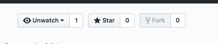
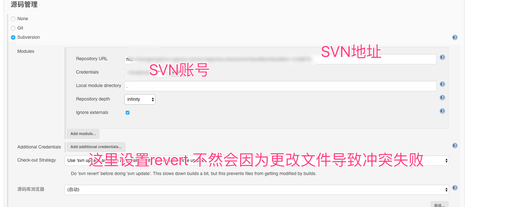
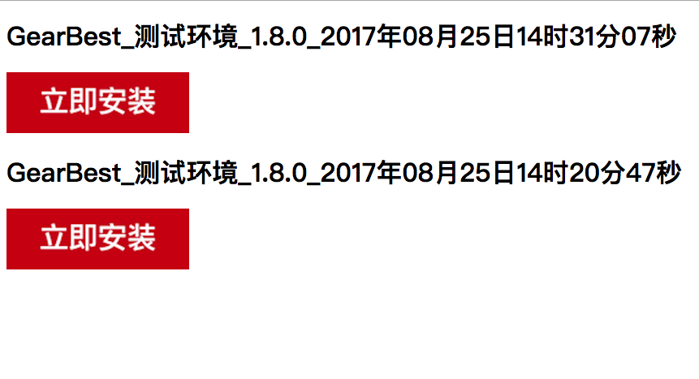

# 基于Fastlane+Jenkins+Github+MAMP+iPATools搭建本地ATO内网ipa安装环境

## 需要的安装的软件

* MAMP
* Fastlane
* Jenkins
* iPATools

## 第一步 安装MAMP


前往下载地址->https://www.mamp.info/en/downloads/

下载安装完毕 启动服务 设置端口如下


**需要注意的是端口要设置8888 如果设置其他接口请用iPATools工具设置默认端口是读取8888**

我们拖拽**/Applications/MAMP/htdocs**文件夹快捷菜单上面


**这个主要是方便我们以后操作文件**

## 2 配置htdoc文件夹

下载 配置文件https://github.com/josercc/iPATools/blob/developer-josercc/htdocs.zip?raw=true

复制下载出来htdocs里面的全部文件到/Applications/MAMP/htdocs下

## 3 Git Clone 项目

打开项目https://github.com/iPATools/iPAToolPlist



Fork项目之后Clone自己的项目到/Applications/MAMP/htdocs下

**需要注意的是必须使用SSH进行Clone这样是为了让命令行不需要输入账号和密码就可以上传文件了**

## 4.安装Jenkins

下载Jenkins https://jenkins.io/download/thank-you-downloading-osx-installer-stable

之后启动

## 5 安装Fastlane

前往https://github.com/fastlane/fastlane查看安装文档

## 6 下载iPATools

前往https://github.com/josercc/iPATools/releases下载最新的Release

## 7 配置工程Fastlane文件

```ruby

def archiveipa(configuration)
  time = Time.new
  version = get_version_number(xcodeproj: "xcodepro文件名称")
  build_number_int = Time.new.to_i
  build_name = version + "." + build_number_int.to_s
  set_info_plist_value(key:"CFBundleVersion", value:build_name, path: "Info.plist相对路径")
  output_directory = "/Applications/MAMP/htdocs/ipa/"
  output_name = "APP名称_" + configuration + "_" + version + "_" + build_number_int.to_s
  gym(scheme: 'scheme名称', export_method: 'ad-hoc', configuration: configuration, output_directory: output_directory, output_name:output_name, clean:true)
end

lane :beta do |values|
  archiveipa "Debug"
end

lane :applive do |values|
  archiveipa "Release"
end
```

## 8 配置jenkins



新建执行脚本

```ruby
#!/bin/bash
fastlane beta // 执行打包版本
cd /Applications
iPATools public // 执行iPATools进行发布
cd /Applications/MAMP/htdocs/iPAToolPlist /// 上传配置文件到github
git add .
git commit -m "change"
git push
```

这样每次使用Jenkins打包完毕就会自动上传进行在线安装了。



安装界面有点丑但是实用

这样我们就可以打开0.0.0.0:8888进行安装了

**如果想通过内网让其他同事安装必须设置iPATools server为你本机的ip**

