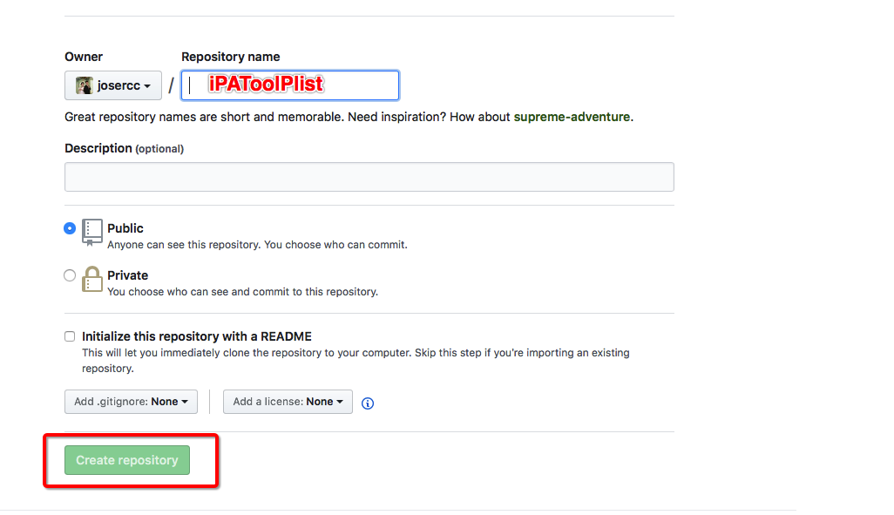

# 基于Fastlane+Jenkins+Github+MAMP+iPATools搭建本地ATO内网ipa安装环境

## 需要的安装的软件

* MAMP
* Fastlane
* Jenkins
* iPATools

## 第一步 安装MAMP

前往下载地址->https://www.mamp.info/en/downloads/

下载安装完毕 启动服务 设置端口如下

**需要注意的是端口要设置8888 如果设置其他接口请用iPATools工具设置默认端口是读取8888**

我们拖拽**/Applications/MAMP/htdocs**文件夹快捷菜单上面

**这个主要是方便我们以后操作文件**

## 第二部 配置存放plist文件的库

**我们要设置库名称为iPAToolsPlist如果是其他的需要通过iPATools 工具进行配置**

我们使用**SSH**的方式进行clone到我们的网站根目录**/Applications/MAMP/htdocs**

**为什么我们要使用SSH的方式呢？因为使用SSH这样对于我们脚本执行上传很方便！**

我们在**/Applications/MAMP/htdocs**新建一个文件夹ipa用来存放我们打包出来的ipa安装包

